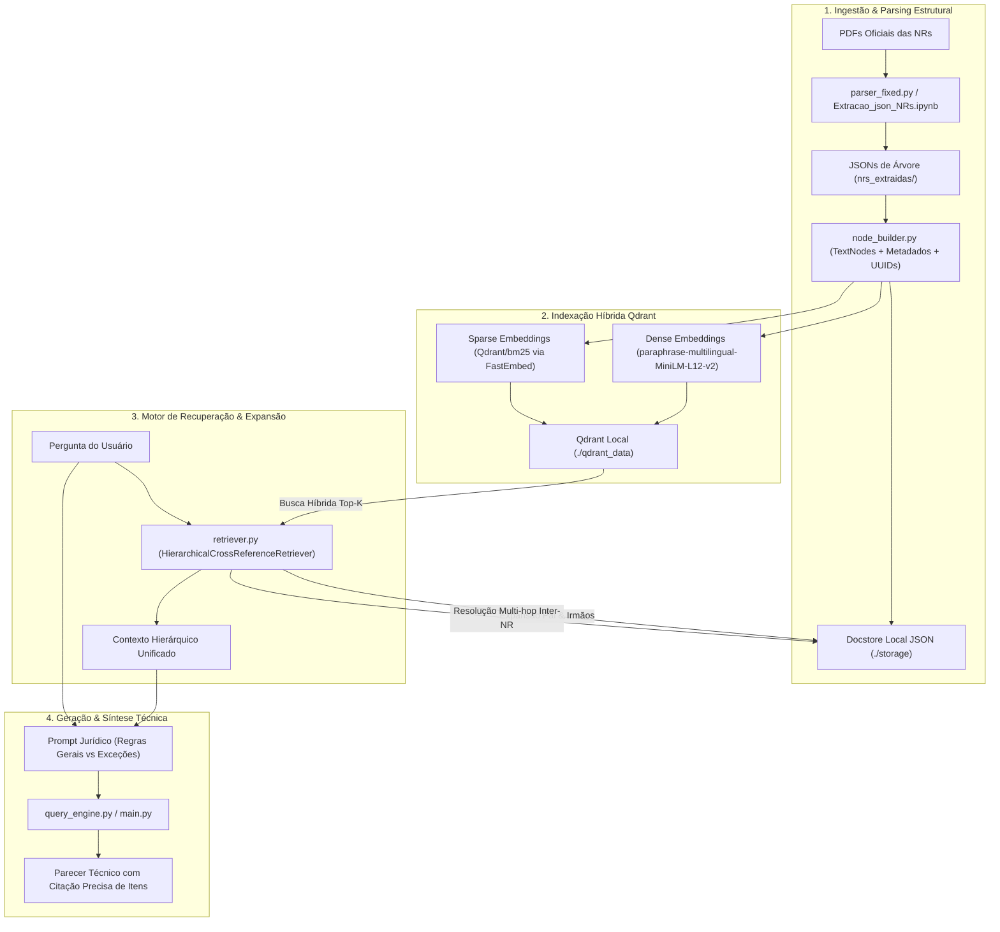

# 🏛️ RAG Hierárquico e Resolução de Referências Cruzadas para Normas Regulamentadoras (NRs)

[](https://www.python.org/)
[](https://www.llamaindex.ai/)
[](https://qdrant.tech/)
[](LICENSE)
[](https://colab.research.google.com/)

> **Prova de Conceito (PoC) para Artigo Acadêmico:**  
> Implementação de uma arquitetura de **Retrieval-Augmented Generation (RAG) Hierárquico** com **Indexação Híbrida (Dense + BM25)** e **Resolução em Grafo de Referências Cruzadas Inter-Normas**, aplicada ao arcabouço de Segurança e Saúde no Trabalho brasileiro.

---

## 📌 1. Contexto e Motivação Acadêmica

Normas Regulamentadoras (NRs) e diplomas jurídicos possuem características estruturais que desafiam os sistemas de RAG tradicionais baseados em *chunking plano* (*flat chunking*):

1. **Dependência Hierárquica Estrita**: Um subitem regulatório (ex.: `Item 10.2.4`) só possui validade material quando qualificado pela sua seção de escopo pai (`Seção 10.2 - Medidas de Controle`). O chunking plano fragmenta o texto e perde a relação de subordinação (regras gerais vs. exceções).
2. **Alta Densidade de Termos Técnicos e Acrônimos**: Termos como `CIPA`, `CA`, `SPQ`, `SPDA`, `75 kW`, `IPVS` e códigos de artigos exigem correspondência exata. A busca puramente vetorial densa pode sofrer com alucinações semânticas; por isso, a **Busca Híbrida (Denso + BM25 esparso)** é mandatória.
3. **Interdependência e Referências Cruzadas Inter-Normas**: As NRs não são documentos isolados. A NR-10 (Eletricidade) e a NR-35 (Trabalho em Altura) frequentemente remetem à NR-06 para seleção de Equipamentos de Proteção Individual (EPIs) ou à NR-01 para gerenciamento de riscos (PGR). 

Este repositório implementa uma arquitetura capaz de:
- Indexar as normas preservando a árvore genealógica de cada item (`PARENT`, `CHILD`, `PREVIOUS`, `NEXT`).
- Expandir dinamicamente o contexto dos nós pais durante a recuperação.
- Realizar consultas multi-hop silenciosas para resolver referências cruzadas dentro do escopo.

---

## 🎯 2. Escopo Regulatório (5 NRs)

O escopo experimental deste trabalho abrange 5 normas fundamentais:

| Norma | Título / Tema Principal | Nós Estruturados |
| :--- | :--- | :---: |
| **NR-05** | Comissão Interna de Prevenção de Acidentes e de Assédio (CIPA) | 101 nós |
| **NR-06** | Equipamentos de Proteção Individual (EPI) | 13 nós |
| **NR-10** | Segurança em Instalações e Serviços em Eletricidade | 118 nós |
| **NR-11** | Transporte, Movimentação, Armazenagem e Manuseio de Materiais | 38 nós |
| **NR-35** | Trabalho em Altura e Proteção Contra Quedas | 60 nós |
| **TOTAL** | **Arcabouço Regulatório Indexado** | **330 nós** |

---

## 🏗️ 3. Arquitetura do Sistema



---

## 📁 4. Estrutura do Repositório

```bash
.
├── nrs_extraidas/                # JSONs estruturados das NRs (árvore hierárquica)
│   ├── nr_05_tree.json
│   ├── nr_06_tree.json
│   ├── nr_10_tree.json
│   ├── nr_11_tree.json
│   └── nr_35_tree.json
├── NR-05.pdf                     # PDF oficial da NR-05
├── NR-06.pdf                     # PDF oficial da NR-06
├── NR-10.pdf                     # PDF oficial da NR-10
├── NR-11.pdf                     # PDF oficial da NR-11
├── NR-35.pdf                     # PDF oficial da NR-35
├── parser.py                     # Parser inicial de extração de PDFs para JSON
├── parser_fixed.py               # Parser refinado com suporte a prefixos de capítulos
├── Extracao_json_NRs.ipynb       # Notebook original de extração e validação das árvores
├── RAG_Hierarquico_NRs_Colab.ipynb # Notebook pronto para execução no Google Colab
├── config.py                     # Configurações centralizadas (caminhos, escopo, modelos)
├── node_builder.py               # Conversor dos nós em TextNodes LlamaIndex com grafo hierárquico
├── ingest.py                     # Script de indexação híbrida no Qdrant Local
├── retriever.py                  # Motor de busca híbrida, expansão hierárquica e referências cruzadas
├── query_engine.py               # Pipeline de síntese acadêmica e integração com LLM
├── main.py                       # Interface CLI (modo interativo, benchmark e consulta pontual)
├── requirements.txt              # Dependências do projeto
└── README.md                     # Documentação completa
```

---

## 🚀 5. Como Executar

### Opção A: Executar Localmente (Computador / VS Code)

#### 1. Clonar o repositório e criar o ambiente virtual:
```bash
git clone https://github.com/Ricktheus/Artigo-Rag.git
cd Artigo-Rag

# Criar e ativar ambiente virtual (opcional, mas recomendado)
python -m venv venv
# No Windows:
venv\Scripts\activate
# No Linux/Mac:
source venv/bin/activate
```

#### 2. Instalar as dependências:
```bash
pip install -r requirements.txt
```

#### 3. Executar a Ingestão e Indexação Híbrida:
*(Lê os JSONs, gera os embeddings e salva o banco Qdrant localmente na pasta `./qdrant_data`)*
```bash
python ingest.py
```

#### 4. Executar Consultas:

- **Modo Interativo (Chat no Terminal):**
  ```bash
  python main.py
  ```

- **Bateria de Testes do Artigo (Benchmark Automatizado):**
  ```bash
  python main.py --test
  ```

- **Consulta Direta via Linha de Comando:**
  ```bash
  python main.py --query "Quais estabelecimentos devem manter o Prontuário de Instalações Elétricas na NR-10 e quais EPIs são exigidos?"
  ```

---

### Opção B: Executar no Google Colab (100% Gratuito na Nuvem)

1. Abra o [Google Colab](https://colab.research.google.com/).
2. Faça o upload do notebook [`RAG_Hierarquico_NRs_Colab.ipynb`](./RAG_Hierarquico_NRs_Colab.ipynb).
3. No painel lateral esquerdo (ícone de pasta 📁), faça o upload dos arquivos Python (`config.py`, `node_builder.py`, `ingest.py`, `retriever.py`, `query_engine.py`, `main.py`) e da pasta `nrs_extraidas/`.
4. Execute as células em sequência:
   - **Célula 1**: Instalação automática dos pacotes via pip.
   - **Célula 2**: Ingestão no Qdrant embutido no ambiente do Colab.
   - **Célula 3**: Inicialização do motor de recuperação.
   - **Células 4 e 5**: Execução do benchmark e consultas interativas.

---

## 🔬 6. Bateria de Testes e Resultados Experimentais

O script `main.py --test` executa 5 casos de validação acadêmica:

1. **TEST_01: Exigências de Prontuário Elétrico e Integração com EPIs (NR-10 + NR-06)**
   - *Recuperação:* `Item 10.2.4` (estabelecimentos com carga > 75 kW).
   - *Hierarquia Pai:* `Seção 10.2 - Medidas de Controle`.
   - *Referência Cruzada Resolvida:* `Item 10.2.3` (esquemas unifilares e aterramento).
2. **TEST_02: Definição de Trabalho em Altura e Proteção Contra Quedas (NR-35 + NR-06)**
   - *Recuperação:* `Item 35.2.1` (diferença de nível > 2,0 m com risco de queda) e `Item 35.6.5` (sistemas de proteção).
   - *Hierarquia Pai:* `Seção 35.2 - Campo de Aplicação` e `Seção 35.6 - SPQ`.
   - *Referência Cruzada Resolvida:* Articulação com a NR-06 para requisitos de CA e fabricante.
3. **TEST_03: Estrutura e Atribuições da CIPA (NR-05)**
   - *Recuperação:* `Item 5.3` (Atribuições) e `Item 5.5` (Processo Eleitoral).
   - *Hierarquia Pai:* `Seção 5.1 - Objetivo` e `Seção 5.4 - Constituição e Estruturação`.
4. **TEST_04: Operação de Equipamentos de Movimentação de Cargas (NR-11)**
   - *Recuperação:* `Item 11.1.1` (poços de elevadores cercados) e `Item 11.1.3` (pontes-rolantes, empilhadeiras e talhas).
5. **TEST_05: Responsabilidades sobre Fornecimento e Uso de EPI (NR-06 + NR-10)**
   - *Recuperação:* `Item 6.5.1` (obrigações da organização), `Item 6.6.1` (obrigações do trabalhador) e integração com `Item 10.13.4`.

---

## 🛠️ Tecnologias Utilizadas

- **LlamaIndex Core**: Orquestração do grafo de nós, relacionamentos estruturais (`NodeRelationship`) e abstração de retrievers customizados.
- **Qdrant Client & Vector Store**: Banco vetorial local embutido em disco com busca híbrida integrada.
- **Sentence-Transformers & HuggingFace**: Modelo de embeddings multilíngue `paraphrase-multilingual-MiniLM-L12-v2`.
- **FastEmbed**: Extração e representação de vetores esparsos BM25 (`Qdrant/bm25`).
- **PDFPlumber**: Extração determinística de layout e tabelas dos documentos oficiais.

---

## 📜 Licença

Este projeto é disponibilizado sob a licença [MIT](LICENSE). Desenvolvido para fins de pesquisa acadêmica e comprovação empírica de arquiteturas RAG aplicadas ao direito regulatório brasileiro.
