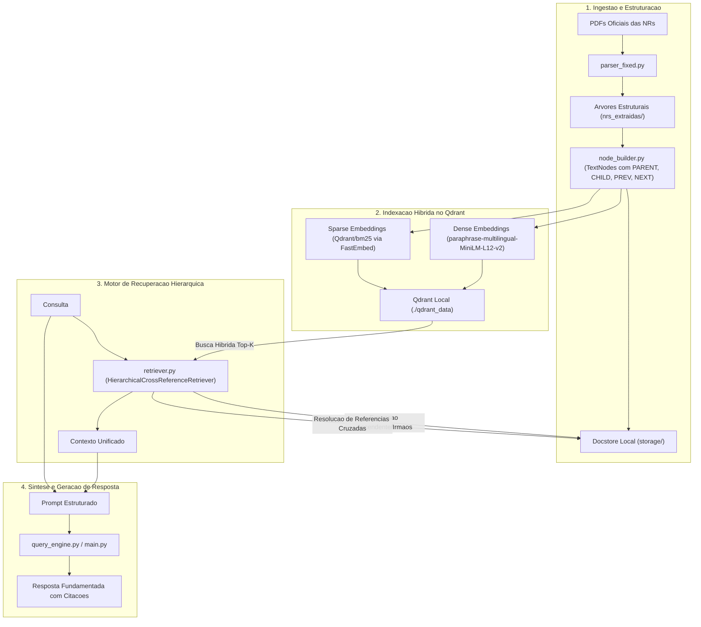

# RAG Hierarquico e Resolucao de Referencias Cruzadas para Normas Regulamentadoras (NRs)

[](https://www.python.org/)
[](https://www.llamaindex.ai/)
[](https://qdrant.tech/)
[](LICENSE)

Repositorio complementar com o codigo-fonte e experimentos de avaliacao de arquitetura de Recuperacao Aumentada por Geracao (RAG) aplicada ao dominio juridico-regulatorio brasileiro. O trabalho investiga tecnicas de indexacao estruturada em arvore, busca hibrida (Dense + BM25) e navegacao em grafo para resolucao de referencias inter-normas nas Normas Regulamentadoras (NRs) de Seguranca e Saude no Trabalho.

---

## 1. Fundamentacao Teorica e Motivacao

Modelos convencionais de RAG fundamentados em segmentacao plana (*flat chunking*) por tamanho de janela de contexto apresentam degradacao de desempenho quando aplicados a diplomas normativos complexos. Os principais desafios tecnicos identificados compreendem:

1. **Dependencia Hierarquica de Escopo**: Subitens regulatorios sao subordinados a secoes, capitulos e disposicoes gerais que definem seu campo de aplicacao material e subjetivo. A perda do no ancestral descontextualiza a regra especifica.
2. **Vocabulario Tecnico Especializado e Acronimos**: A presenca frequente de parametros numericos e siglas tecnicas (e.g., CIPA, CA, SPQ, SPDA, 75 kW) demanda casamento lexico preciso, tornando a busca puramente semantica insuficiente.
3. **Interconexao Normativa**: Dispositivos legais realizam remissao expressa a normas correlatas (e.g., a NR-10 e a NR-35 remetem a NR-06 para especificacao e gestao de EPIs).

A arquitetura proposta estrutura as normas como arvores hierarquicas conectadas, permitindo a reconstrucao ascendente de contexto e a resolucao de referencias cruzadas no momento da inferencia.

---

## 2. Escopo Experimental

O estudo delimita a analise experimental a um corpus composto por 5 Normas Regulamentadoras:

| Norma | Descricao Tematica | Total de Nos |
| :--- | :--- | :---: |
| **NR-05** | Comissao Interna de Prevencao de Acidentes e de Assedio (CIPA) | 101 |
| **NR-06** | Equipamentos de Protecao Individual (EPI) | 13 |
| **NR-10** | Seguranca em Instalacoes e Servicos em Eletricidade | 118 |
| **NR-11** | Transporte, Movimentacao, Armazenagem e Manuseio de Materiais | 38 |
| **NR-35** | Trabalho em Altura | 60 |
| **Total** | **Corpus Estruturado** | **330 nos** |

---

## 3. Arquitetura do Sistema



---

## 4. Estrutura de Arquivos

```text
.
├── nrs_extraidas/                  # Arvores estruturais das NRs em formato JSON
│   ├── nr_05_tree.json
│   ├── nr_06_tree.json
│   ├── nr_10_tree.json
│   ├── nr_11_tree.json
│   └── nr_35_tree.json
├── NR-05.pdf                       # Texto oficial da NR-05
├── NR-06.pdf                       # Texto oficial da NR-06
├── NR-10.pdf                       # Texto oficial da NR-10
├── NR-11.pdf                       # Texto oficial da NR-11
├── NR-35.pdf                       # Texto oficial da NR-35
├── parser.py                       # Extrator de PDFs para representacao em arvore
├── parser_fixed.py                 # Extrator com correcoes de prefixos de capitulos
├── Extracao_json_NRs.ipynb         # Notebook de apoio para extracao das normas
├── RAG_Hierarquico_NRs_Colab.ipynb # Notebook para reproducao no Google Colab
├── config.py                       # Parametros de execucao, modelos e caminhos
├── node_builder.py                 # Construcao de TextNodes e mapeamento de relacionamentos
├── ingest.py                       # Pipeline de indexacao no Qdrant
├── retriever.py                    # Implementacao do retriever hierarquico e referencial
├── query_engine.py                 # Mecanismo de sintese de respostas e prompts
├── main.py                         # Interface CLI para testes e consultas
├── requirements.txt                # Dependencias do projeto
└── README.md                       # Documentacao tecnica
```

---

## 5. Instrucoes de Execucao

### Execucao Local

1. Clonar o repositorio e navegar para o diretorio:
```bash
git clone https://github.com/Ricktheus/Artigo-Rag.git
cd Artigo-Rag
```

2. Configurar o ambiente virtual e instalar as dependencias:
```bash
python -m venv venv

# Windows:
venv\Scripts\activate

# Linux / macOS:
source venv/bin/activate

pip install -r requirements.txt
```

3. Executar o pipeline de ingestao e indexacao:
```bash
python ingest.py
```

4. Execucao de consultas:

- **Execucao da bateria de testes (Benchmark):**
  ```bash
  python main.py --test
  ```

- **Consulta pontual via argumento:**
  ```bash
  python main.py --query "Quais estabelecimentos devem manter o Prontuario de Instalacoes Eletricas na NR-10 e quais EPIs sao exigidos?"
  ```

- **Modo interativo:**
  ```bash
  python main.py
  ```

---

### Execucao no Google Colab

1. Fazer o upload do arquivo `RAG_Hierarquico_NRs_Colab.ipynb` para o Google Colab.
2. Transferir os modulos Python (`config.py`, `node_builder.py`, `ingest.py`, `retriever.py`, `query_engine.py`, `main.py`) e a pasta `nrs_extraidas/` para o ambiente do runtime.
3. Executar as celulas do notebook de forma sequencial para instalacao de dependencias, ingestao dos dados e realizacao das consultas.

---

## 6. Casos de Teste e Validacao

A suite automatizada implementada em `main.py --test` avalia os seguintes cenarios experimentais:

1. **TEST_01**: Requisitos para constituicao do Prontuario de Instalacoes Eletricas (NR-10, Item 10.2.4) e articulacao com esquemas unifilares (Item 10.2.3).
2. **TEST_02**: Delimitacao de trabalho em altura (NR-35, Item 35.2.1) e requisitos de sistemas de protecao contra quedas associados a NR-06.
3. **TEST_03**: Atribuicoes e dimensionamento da CIPA (NR-05, Itens 5.3 e 5.4).
4. **TEST_04**: Requisitos de seguranca para operacao de equipamentos de transporte e movimentacao de materiais (NR-11, Itens 11.1.1 e 11.1.3).
5. **TEST_05**: Responsabilidades de organizacoes e empregados na gestao de EPIs (NR-06, Itens 6.5.1 e 6.6.1).

---

## 7. Componentes Tecnicos

- **LlamaIndex Core**: Gerenciamento de nos, relacionamentos estruturais (`NodeRelationship`) e extensao de `BaseRetriever`.
- **Qdrant Client & Vector Store**: Armazenamento vetorial em disco com suporte a busca hibrida.
- **HuggingFace / Sentence-Transformers**: Modelo `sentence-transformers/paraphrase-multilingual-MiniLM-L12-v2` para representacao densa em portugues.
- **FastEmbed**: Geracao de representacoes esparsas baseadas em BM25 (`Qdrant/bm25`).
- **PDFPlumber**: Extracao textual estruturada a partir dos documentos normativos oficiais.

---

## 8. Licenca

Este projeto e distribuido sob a licenca MIT. Consulte o arquivo `LICENSE` para mais detalhes.
